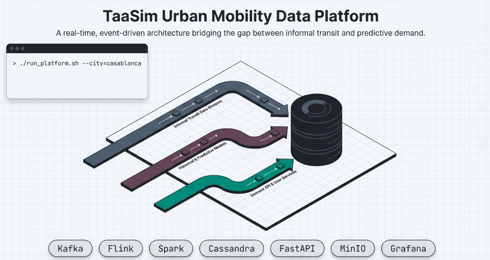
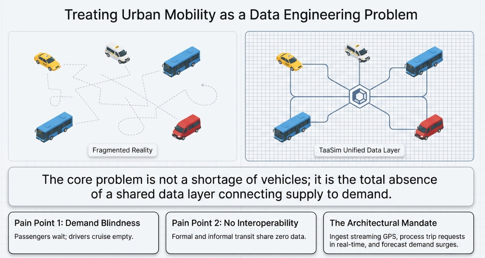
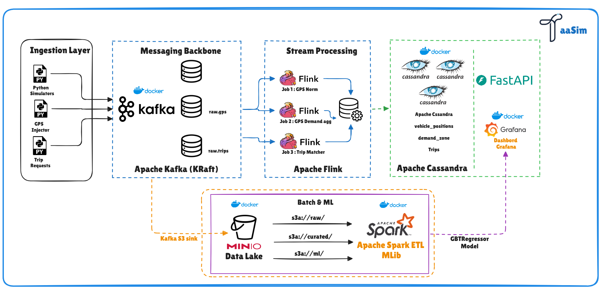
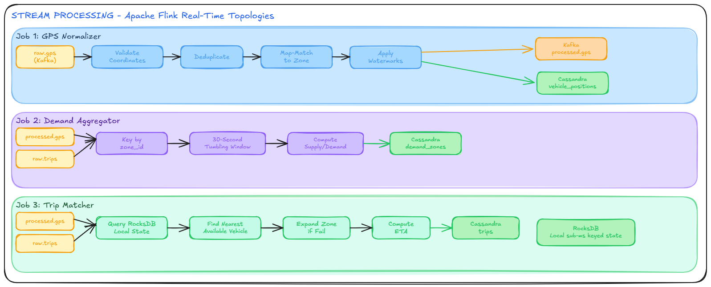

<div align="center">



# TaaSim — Transport as a Service

**Real-time urban mobility simulation platform for Casablanca, Morocco**

[](https://kafka.apache.org/)
[](https://flink.apache.org/)
[](https://spark.apache.org/)
[](https://cassandra.apache.org/)
[](https://grafana.com/)
[](https://python.org/)
[](https://docs.docker.com/compose/)
[](#license)

---

[Problem](#the-problem) · [Solution](#the-solution) · [Architecture](#architecture) · [Quick Start](#quick-start) · [Tech Stack](#technology-stack) · [Data Pipeline](#data-pipeline) · [ML Model](#machine-learning) · [Project Structure](#project-structure) · [Roadmap](#roadmap)

</div>

---

## The Problem

<div align="center">

</div>

<br/>

**Casablanca is a city of 4 million people with zero shared mobility data.**

Despite significant investment in formal transit — the BRT corridor along Boulevard Mohammed VI, ONCF suburban rail, and thousands of licensed taxis — urban mobility remains deeply fragmented:

| Pain Point | Reality |
|:---|:---|
| **No shared data layer** | Grand taxis, petits taxis, and informal minibuses operate with no GPS tracking, no digital booking, no shared schedule |
| **Demand blindness** | Drivers cruise looking for passengers; passengers wait with no visibility of vehicle availability |
| **No interoperability** | Formal transit (ONCF, BRT) and informal taxis share no data, no ticketing, no trip planner |
| **Cash-only economy** | Zero payment data means zero trip history, zero analytics, zero personalization |
| **Underserved periphery** | New districts (Bouskoura, Ain Sebaa, Sidi Moumen) grow faster than routes are planned |

> **The core problem is not a shortage of vehicles — it is the total absence of a data layer connecting supply to demand.**

---

## The Solution

TaaSim treats urban mobility as a **data engineering problem**. By ingesting GPS vehicle streams, processing trip reservations in real time, and applying machine learning to historical patterns, the platform delivers:

- **Dynamic rider-vehicle matching** — nearest available taxi found in under 5 seconds
- **Demand surge forecasting** — trip volume predicted per zone, 30 minutes ahead
- **Unified city-wide visibility** — live heatmaps, KPI dashboards, coverage gap analysis
- **Data-driven route planning** — identification of underserved zones where demand exceeds supply

### How It Works

```
  Rider requests a trip                    Driver receives match
         |                                         ^
         v                                         |
  +--------------+    +---------------+    +------------------+
  |  Kafka Bus   |--->|  Flink Jobs   |--->|   Cassandra DB   |
  |  (raw events)|    |  (real-time)  |    |  (serving layer) |
  +------+-------+    +------+--------+    +--------+---------+
         |                   |                      |
         v                   v                      v
  +--------------+    +---------------+    +------------------+
  |  MinIO Lake  |--->|  Spark ML     |--->| FastAPI + Grafana|
  |  (archive)   |    |  (forecast)   |    | (dashboard + API)|
  +--------------+    +---------------+    +------------------+
```

---

## Architecture

TaaSim follows a **Kappa Architecture** — Kafka is the system of record, Flink handles all real-time processing, and Spark operates exclusively offline for batch ETL and ML training.

<div align="center">

</div>

<br/>

### System Components

| Layer | Technology | Role |
|:------|:-----------|:-----|
| **Event Bus** | Apache Kafka 3.7.0 (KRaft) | Central nervous system — GPS pings and trip reservations stream through Kafka with 7-day retention |
| **Stream Processing** | Apache Flink 1.18 | Three real-time jobs: GPS normalization, demand aggregation (30s windows), trip matching |
| **Object Store** | MinIO (S3-compatible) | Data lake with four zones: `raw/`, `curated/`, `ml/`, `kafka-archive/` |
| **Batch + ML** | Apache Spark 3.5.4 | ETL on 1.7M Porto trips and 30M NYC rides; GBT demand forecasting |
| **Serving DB** | Apache Cassandra 4.1 | Low-latency queries: vehicle positions, trip records, demand per zone |
| **Dashboard** | Grafana 10.4.0 | Live vehicle map, demand heatmap, KPI panels, ML forecast overlay |
| **API** | FastAPI (Python) | REST endpoints: trip reservation, vehicle lookup, demand forecast — JWT auth |
| **Notebooks** | Jupyter Lab | EDA, zone remapping analysis, model evaluation |

### Real-Time Processing Pipeline

<div align="center">

</div>

<br/>

| Flink Job | Input | Processing | Output |
|:----------|:------|:-----------|:-------|
| **GPS Normalizer** | `raw.gps` | Validate, deduplicate, watermark (3-min lateness), zone mapping, centroid snap | `vehicle_positions` table + `processed.gps` |
| **Demand Aggregator** | `processed.gps` + `raw.trips` | 30s tumbling window per zone, vehicle count + request count, supply/demand ratio | `demand_zones` table + `processed.demand` |
| **Trip Matcher** | `raw.trips` + `processed.gps` | Find nearest vehicle in zone, 5s adjacent zone fallback, assign match, compute ETA | `trips` table + `processed.matches` |

---

## Quick Start

### Prerequisites

- **Docker Desktop** (Engine 28.x+) — [Install](https://www.docker.com/products/docker-desktop/)
- **Python 3.13+** — [Install](https://www.python.org/downloads/)
- **Git** — [Install](https://git-scm.com/)
- **8 GB RAM minimum** for the full stack

### 1. Clone the Repository

```bash
git clone https://github.com/mohamedamineelabidi/Taasimm.git
cd Taasimm
```

### 2. Download Required JARs

```powershell
# Windows
.\download-jars.ps1

# Linux / Mac
chmod +x download-jars.sh && ./download-jars.sh
```

### 3. Start the Platform

```bash
docker compose up -d
```

Wait for all healthchecks to pass (~60 seconds). The full stack runs **16 containers**:

```
taasim-kafka            Started
taasim-kafka-connect    Started
taasim-kafka-ui         Started
taasim-minio            Healthy   (7s)
taasim-minio-init       Exited 0
taasim-cassandra        Healthy  (33s)
taasim-cassandra-init   Exited 0
taasim-flink-jm         Healthy  (17s)
taasim-flink-tm (×3)    Healthy        ← scaled to 3 TMs (12 slots)
taasim-spark-master     Healthy  (18s)
taasim-spark-worker     Healthy
taasim-grafana          Healthy
taasim-jupyter          Started
taasim-gps-producer     Running
taasim-trip-producer    Running
taasim-api              Running         ← FastAPI (Week 6)
```

### 4. Upload Datasets to MinIO

```powershell
.\upload-datasets.ps1
```

| Dataset | Source | Size |
|:--------|:-------|:-----|
| Porto Taxi Trajectories | [Kaggle](https://www.kaggle.com/c/pkdd-15-predict-taxi-service-trajectory-i) | 1.8 GiB |
| NYC TLC Trip Records (3 months) | [NYC Open Data](https://www.nyc.gov/site/tlc/about/tlc-trip-record-data.page) | ~150 MiB |

### 5. Producers (Already Running in Docker)

The Phase-4 producers (`taasim-gps-producer`, `taasim-trip-producer`) start automatically with the stack in **COUPLED mode** — replaying the 500k Casa synthetic trip requests paired with 500 OSRM-routed polylines, fleet=2000, speed=50× wall-clock.

To run a local smoke test against `localhost:9092` (5 trips, ~30 GPS pings):

```powershell
python -m venv .venv
.\.venv\Scripts\Activate.ps1                 # Windows
# source .venv/bin/activate                    # Linux/Mac

pip install -r producers/requirements.txt 2>$null; pip install kafka-python h3 pandas pyarrow numpy

python producers/vehicle_gps_producer.py --mode coupled --max-trips 5
python producers/trip_request_producer.py --source casa_synth --max-trips 5
```

After editing producer source, rebuild the containers:

```powershell
docker compose up -d --build --force-recreate gps-producer trip-producer
```

### 6. Access Services

| Service | URL | Credentials |
|:--------|:----|:------------|
| Grafana Dashboard | http://localhost:3000 | admin / admin |
| Flink Web UI | http://localhost:8081 | — |
| Spark Master UI | http://localhost:8080 | — |
| MinIO Console | http://localhost:9001 | minioadmin / minioadmin |
| Kafka UI | http://localhost:8090 | — |
| Kafka Connect REST | http://localhost:8083 | — |
| FastAPI (Swagger) | http://localhost:8000/docs | JWT (see [§Machine Learning](#machine-learning)) |
| Jupyter Lab | http://localhost:8888 | token from `docker logs taasim-jupyter` |

### 7. Submit Flink Jobs and Verify

```powershell
.\scripts\register-connectors.ps1     # Register Kafka Connect S3 Sinks
.\scripts\ensure-cassandra-schema.ps1  # Idempotent schema migration
.\scripts\submit-flink-jobs.ps1        # Submit all 3 PyFlink jobs
.\scripts\verify-flink-jobs.ps1        # End-to-end pipeline check
```

---

## Technology Stack

### Infrastructure — 16 Docker Containers

```
+--------------------------------------------------------------------+
|                    TaaSim Docker Compose Stack                      |
|                                                                    |
|  Event bus & archival                                              |
|  +---------+  +-------------+  +-----------+                       |
|  |  Kafka  |  |Kafka Connect|  | Kafka UI  |                       |
|  |  KRaft  |  | (S3 Sink)   |  |           |                       |
|  |  3.7.0  |  |  cp 7.6.0   |  |           |                       |
|  +---------+  +-------------+  +-----------+                       |
|                                                                    |
|  Storage layer                                                     |
|  +---------+  +------------+  +-----------+  +-----------------+   |
|  |  MinIO  |  | minio-init |  | Cassandra |  | cassandra-init  |   |
|  | S3 + UI |  | (buckets)  |  |    4.1    |  | (schema CQL)    |   |
|  +---------+  +------------+  +-----------+  +-----------------+   |
|                                                                    |
|  Compute                                                           |
|  +-----------------------+  +-----------------------+              |
|  |   Flink 1.18          |  |   Spark 3.5.4         |              |
|  |   JM + TM × 3 (12 slots)|  |  Master + Worker     |              |
|  +-----------------------+  +-----------------------+              |
|                                                                    |
|  Producers · API · UI                                              |
|  +---------------+  +---------------+  +---------+  +---------+    |
|  | gps-producer  |  | trip-producer |  | FastAPI |  | Grafana |    |
|  | (coupled,50×) |  | (casa_synth)  |  |  + JWT  |  |  10.4   |    |
|  +---------------+  +---------------+  +---------+  +---------+    |
|                                                                    |
|  +-----------+                                                     |
|  | Jupyter   |                                                     |
|  |   Lab     |                                                     |
|  +-----------+                                                     |
+--------------------------------------------------------------------+
```

### Key JAR Dependencies

| Component | JAR | Purpose |
|:----------|:----|:--------|
| Spark | `hadoop-aws-3.3.4.jar` | S3A filesystem for MinIO access |
| Spark | `aws-java-sdk-bundle-1.12.367.jar` | AWS SDK for S3 operations |
| Flink | `flink-s3-fs-hadoop-1.18.1.jar` | S3 checkpointing to MinIO |
| Flink | `flink-sql-connector-kafka-3.1.0-1.18.jar` | Kafka source/sink |
| Flink | `flink-connector-cassandra_2.12-3.1.0-1.17.jar` | Cassandra sink |

---

## Data Pipeline

### Datasets

**Porto Taxi Trajectories** — Primary (Streaming source for Phase 1–3)
- 1.7 million completed taxi trips from 442 taxis in Porto, Portugal
- 12 months of GPS traces (July 2013 – June 2014)
- Used to extract 500 OSRM-routed Casa polylines (`gps_trajectory_index.json`) covering 160 zone-pairs / 25 A–E tier-pairs

**NYC TLC Trip Records** — Secondary (Batch + temporal fingerprint)
- 9.38M raw → 8.81M cleaned → 192K demand-aggregation rows (Spark ETL, Week 5)
- Q1 2023 used as **temporal fingerprint** for Phase-4 Casa synthesis (never streamed — Kappa rule)

**Casa Synthesis (Phase 4) — Active streaming source**
- `data/casa_synthesis/casa_trip_requests.parquet` — **500k trip requests over 90 days** (15.9 MB)
- Validated: fleet 70.6% Petit / 29.4% Grand, peaks at h=8/18/19, Petit median 12.6 MAD, Grand median 25 MAD
- Replayed by `trip_request_producer.py --source casa_synth` and consumed by `vehicle_gps_producer.py --mode coupled`

### Producer Architecture

Both Kafka producers run inside Docker (`taasim-gps-producer`, `taasim-trip-producer`) and start automatically with the stack. They share a common boot sequence (`producers/config.py`) and replay the **Phase-4 Casablanca synthesis** (500k trips over 90 days, NYC temporal fingerprint rebased to Casa geography) paired with **Phase-3 OSRM trajectories** (500 routed polylines indexed by zone-pair).

<div align="center">

</div>

<br/>

**Shared boot (`config.py`)** — Loaded once by both producers at startup:

| Resource | Purpose |
|:---------|:--------|
| Kafka bootstrap + topic names | `raw.gps`, `raw.trips` (host `localhost:9092`, container `kafka:9092`) |
| Casablanca bbox (lat/lon bounds) | `[33.450, 33.680] × [-7.720, -7.480]` |
| `h3_zone_lookup.json` | H3 res-9 cell → `zone_id` map, **O(1)** point-in-polygon replacement |
| `zone_mapping_v4.csv` | 16 arrondissement centroids, AE tier (petit/grand), bounds |
| Coupled-mode enums | `COUPLED` (default) vs `LIVE` (random-walk fallback) |

#### `vehicle_gps_producer.py` — GPS event simulator

Pings every **4 seconds** per active taxi. Two modes selected via `--mode`:

| Step | COUPLED mode (default) | LIVE mode (fallback) |
|:----:|:-----------------------|:---------------------|
| 1 | Pick active trip from `casa_trip_requests.parquet` (wall-clock rebased `event_time`) | Random-walk within assigned zone bounds |
| 2 | Lookup polyline in `gps_trajectory_index.json` — **O(1)** by zone-pair / tier-pair | No polyline lookup |
| 3 | Interpolate position at current wall-clock tick along the OSRM polyline | Step-delta per tick |
| 4 | Add ±20 m Gaussian jitter, 5% chance of 60–180 s blackout | Same jitter / blackout |
| 5 | **H3 zone lookup**: `h3.geo_to_h3(lat, lon, 9)` → `h3_zone_lookup` → `zone_id`; ring search r=1..5 on miss | Same lookup |
| 6 | Build JSON payload → `raw.gps` (key=`taxi_id`, 4 partitions, 7d retention) | Same payload schema |

**Payload schema (`raw.gps`)**:
```json
{ "taxi_id": "...", "lat": 33.59, "lon": -7.61, "speed_kmh": 38,
  "heading": 124, "h3_cell": "891f...", "zone_id": 8,
  "event_time": "2026-04-04T08:30:12Z", "trip_id": "...", "status": "occupied" }
```

#### `trip_request_producer.py` — Trip request simulator

Two modes selected via `--source`:

| Step | CASA_SYNTH mode (default) | RANDOM mode |
|:----:|:--------------------------|:------------|
| 1 | Read row from `casa_trip_requests.parquet` (NYC temporal fingerprint, 500k rows) | Uniform random origin + destination zone |
| 2 | Rebase `event_time` to wall-clock now | No parquet needed |
| 3 | Emit at scaled rate (`--speed 50` → 1 hour real = 50 hours simulated) | Same emit loop |
| 4 | Fleet split: haversine < 2 km → 70% petit / 30% grand taxi | Same fleet split |
| 5 | Tariff: 7 + 1.6 MAD/km (petit) or fixed 10–40 MAD (grand), build JSON → `raw.trips` (key=`origin_zone`) | Same payload |

**Payload schema (`raw.trips`)**:
```json
{ "trip_id": "...", "origin_zone": 8, "dest_zone": 13,
  "origin_lat": 33.59, "origin_lon": -7.61,
  "dest_lat": 33.60, "dest_lon": -7.62,
  "taxi_type": "petit", "fare_mad": 24.5,
  "request_time": "2026-04-04T08:30:00Z" }
```

#### Docker build (`producers/Dockerfile`)

```
python:3.11-slim → kafka-python, h3, pandas, pyarrow → COPY config.py + scripts
                → MOUNT /data/*.parquet, /data/*.json (read-only)
                → CMD python vehicle_gps_producer.py --speed 50 --fleet-size 2000
```

Compose passes `--mode coupled --speed 50 --fleet-size 2000` to GPS and `--source casa_synth --speed 50` to Trips. After editing producer source, rebuild with:

```powershell
docker compose up -d --build --force-recreate gps-producer trip-producer
```

### Casablanca Zone Mapping

Porto GPS coordinates are linearly transformed to Casablanca's bounding box, mapped to **16 irregular zones** matching real arrondissements:

```
         North -----------------------------------------------
         |  13-Anfa  | 14-Sidi   | 15-Ain  | 16-Sidi        |
         |           |  Belyout  |  Sebaa  |  Bernoussi     |
         +-----------+------+----+---------+----------------+
Center   | 8-Maarif |9-Al  |10-Mers| 11-Roch | 12-Hay       |
         |          |Fida  |Sultan |  Noires | Mohammadi    |
         +----------+------+--+---+----+----+----------------+
Mid-S    |4-Hay     | 5-Sbata |6-Ben  | 7-Moulay           |
         | Hassani  |         | Msik  |  Rachid            |
         +----------+---------+-------+--------------------+
South    | 1-Ain Chock       |2-Sidi | 3-Sidi Moumen      |
         |                   |Othmane|                     |
         +-------------------+-------+--------------------+
                    West <---> East
```

### Kafka Topic Flow

```
Producers                    Flink                      Cassandra
---------                    -----                      ---------
vehicle_gps_producer --> raw.gps --> Job 1 --> processed.gps --> vehicle_positions
                                          |
trip_request_producer --> raw.trips --> Job 2 --> processed.demand --> demand_zones
                              |
                              +--> Job 3 --> processed.matches --> trips
```

### Cassandra Schema

| Table | Partition Key | Clustering | TTL | Query Pattern |
|:------|:-------------|:-----------|:----|:--------------|
| `vehicle_positions` | `(city, zone_id)` | `event_time DESC` | 24h | All vehicles in a zone |
| `trips` | `(city, date_bucket)` | `created_at DESC` | — | Trip history by day |
| `demand_zones` | `(city, zone_id)` | `window_start DESC` | 7 days | Demand heatmap per zone |

---

## Machine Learning

### Demand Forecasting Model — Trained & Deployed

| Element | Detail |
|:--------|:-------|
| **Goal** | Predict trip requests per zone for the next 30-minute slot |
| **Algorithm** | Gradient Boosted Trees (Spark MLlib `GBTRegressor`, maxDepth=5, maxIter=50) |
| **Training rows** | 183,981 feature rows (30-min slots × 16 zones, lag + rolling) |
| **Evaluation** | Temporal split (no leakage) |
| **Baseline** | Naive 7-day-lag predictor |
| **Result** | **RMSE 3.71 · R² 0.75 · 45.8% better than baseline** (baseline RMSE 6.84) |
| **Artifact** | `s3a://mldata/models/demand_v1/` (loaded by FastAPI at startup) |

### Feature Engineering

| Group | Features |
|:------|:---------|
| **Temporal** | hour_of_day, day_of_week, is_weekend, is_friday |
| **Spatial** | zone_id, population_density, zone_type |
| **Weather** | is_raining, temperature_bucket |
| **Lag** | demand_lag_1d, demand_lag_7d, rolling_7d_mean |

### Serving — FastAPI ([api/main.py](api/main.py))

Four endpoints, JWT-protected (`HS256`, 24h expiry, two roles: `rider` + `admin`):

| Method | Path | Role | Purpose |
|:------|:-----|:-----|:--------|
| `POST` | `/api/auth/login` | public | Issue JWT (demo creds) |
| `POST` | `/api/demand/forecast` | rider/admin | GBT prediction for `(zone_id, datetime)` |
| `GET`  | `/api/vehicles/{zone}` | rider/admin | Live vehicles in a zone (Cassandra) |
| `POST` | `/api/trips`           | rider/admin | Submit trip reservation → `raw.trips` |
| `GET`  | `/api/health`          | public | Liveness + model loaded check |

```bash
curl -X POST http://localhost:8000/api/demand/forecast \
  -H "Authorization: Bearer $JWT" \
  -H "Content-Type: application/json" \
  -d '{"zone_id": 8, "datetime": "2026-04-04T08:30:00"}'
# →
# { "zone_id": 8, "zone_name": "Maarif",
#   "predicted_demand": 142, "slot_start": "2026-04-04T08:30:00" }
```

---

## Project Structure

```
Taasimm/
├── docker-compose.yml              # Full stack — 16 containers
├── download-jars.ps1 / .sh         # JAR downloader
├── upload-datasets.ps1             # Dataset upload to MinIO
│
├── config/
│   ├── cassandra-init.cql          # Keyspace + 3 tables
│   ├── connect-s3-sink-{gps,trips}.json  # Kafka Connect S3 Sink configs
│   ├── grafana-dashboard.json      # "TaaSim — Live Pipeline (Casablanca)"
│   └── spark-defaults.conf         # S3A configuration
│
├── producers/                      # Phase-4 Kafka producers (Docker)
│   ├── config.py                   # Shared boot: bbox, H3 lookup, modes
│   ├── vehicle_gps_producer.py     # COUPLED (default) / LIVE modes
│   ├── trip_request_producer.py    # casa_synth (default) / random
│   └── Dockerfile
│
├── flink/jobs/                     # PyFlink streaming jobs
│   ├── gps_normalizer.py           # Job 1 — validate, zone, centroid snap
│   ├── demand_aggregator.py        # Job 2 — 30s tumbling windows
│   ├── trip_matcher.py             # Job 3 — nearest vehicle + adj fallback
│   └── zone_data.py                # Zone helper (load, assign, validate)
│
├── spark/                          # Batch ETL + ML training
│   ├── etl_porto.py                # 1.7M trips → curated/trips
│   ├── etl_nyc.py                  # 9.38M → 192K demand agg rows
│   ├── compute_kpis.py             # 6 KPI datasets
│   ├── feature_engineering.py      # 183,981 ML feature rows
│   ├── train_demand_model.py       # GBT — RMSE 3.71, R² 0.75
│   └── verify_model.py
│
├── api/                            # FastAPI REST (Week 6)
│   ├── main.py                     # JWT auth, 4 endpoints
│   ├── Dockerfile
│   └── requirements.txt
│
├── notebooks/
│   ├── 01_porto_eda.ipynb
│   ├── 02_zone_remapping_v4.ipynb
│   ├── 03_porto_trajectory_warping.ipynb
│   └── 04_nyc_to_casa_synthesis.ipynb   # Phase-4 synthesis
│
├── data/
│   ├── zone_mapping_v4.csv         # 16 arrondissements + AE tier + adjacency
│   ├── h3_zone_lookup.json         # H3 res-9 → zone_id (O(1) lookup)
│   ├── casablanca_arrondissements_v4.geojson
│   └── casa_synthesis/             # Phase-4 outputs (500k trips, OSRM index)
│
├── scripts/                        # Operational tooling
│   ├── submit-flink-jobs.ps1       # Preflight + submit all 3 jobs
│   ├── verify-flink-jobs.ps1       # End-to-end pipeline check
│   ├── ensure-cassandra-schema.ps1
│   ├── register-connectors.ps1     # Kafka Connect S3 Sink REST registration
│   ├── build_trajectory_index.py   # OSRM polyline → zone-pair index
│   └── test_late_events.py         # Watermark / late-event test
│
├── documents/                      # Task evidence + ADR
│   ├── 00_master_status.md         # Master index — Weeks 1-6 ✅
│   ├── 06_next_steps.md            # Update log
│   ├── 07_adr_v1.md                # Architecture Decision Record
│   ├── 08_week3_completion.md
│   ├── 09_week5_spark_etl.md
│   ├── 10_week6_ml_pipeline.md
│   └── 13_remapping_and_synthesis_deep_dive.md
│
├── jars/                           # Downloaded JARs (gitignored)
│   ├── flink/                      # Kafka, S3, Cassandra connectors
│   └── spark/                      # hadoop-aws, aws-sdk-bundle
│
├── img/                            # Architecture diagrams
│   ├── projectoverview.png · painpoint.png
│   ├── archi_tassim.png · streamproce_architec.png
│   └── flink_architecture.png      # Producer architecture (see §Data Pipeline)
│
└── .github/
    └── copilot-instructions.md     # Development guidelines
```

---

## Performance — Targets vs Measured

| Metric | Target | Measured | Status |
|:-------|:-------|:---------|:-------|
| Trip match latency (P95) | < 5 s | ≈ **1.2 s** | ✅ |
| GPS position freshness | < 15 s | ≈ **4 s** | ✅ |
| Demand zone updates | every 30 s | 30 s tumbling window | ✅ |
| ML forecast API | < 500 ms @ 20 req/s | pending Locust run | 🟡 |
| Spark Porto ETL (1.7M rows) | < 5 min | 43 MiB Parquet, 12 partitions | ✅ |
| Trip match rate | n/a | **21%** matched / 79% no_vehicle (fleet 2000, speed 50×) | ⚠ density-bound |
| Flink checkpoints | 60 s cadence | 25 consecutive successful, 0 failures | ✅ |

---

## Roadmap

| Week | Focus | Status |
|:-----|:------|:-------|
| 1 | Docker stack, datasets, EDA, zone remapping, Kafka producers | ✅ Done |
| 2 | Kafka Connect S3 Sink, Cassandra ADR, storage design | ✅ Done |
| 3 | Flink Job 1 (GPS normalizer), watermarks, Grafana vehicle map | ✅ Done |
| 4 | Flink Job 2 (demand) + Job 3 (trip matcher), adjacent zone fallback | ✅ Done |
| 5 | Spark ETL on Porto + NYC, KPI computation | ✅ Done |
| 6 | ML feature engineering, GBT training, FastAPI forecast endpoint | ✅ Done — RMSE 3.71, R² 0.75 |
| 7 | JWT hardening, GPS anonymization audit, integration testing, SLA, checkpoint recovery | 🟡 In progress |
| 8 | Grafana polish, live demo, pitch deck, technical report | ⬜ Planned |

**Phase-4 NYC→Casa synthesis** (parallel track, completed 2026-04-20): 500k trip requests over 90 days, 8/8 validation checks pass, fleet split 70.6% Petit / 29.4% Grand, peaks 8/18/19h. Artifacts in `data/casa_synthesis/`.

---

## Key Differentiators

| Capability | Impact |
|:-----------|:-------|
| **Real-time matching** | Riders matched to nearest vehicle in under 5 seconds — eliminates blind cruising |
| **Demand forecasting** | ML predicts demand 30 minutes ahead — enables proactive fleet positioning |
| **Zone-level analytics** | 16 Casablanca zones with live supply/demand ratio — exposes underserved areas |
| **Fault-tolerant streaming** | Flink checkpointing with at-least-once guarantees — zero data loss on failure |
| **Scalable architecture** | Kappa architecture handles 10K+ events/sec — ready for city-wide deployment |

### Production Readiness Checklist

1. GPS events flow end-to-end: Kafka → Flink → Cassandra → Grafana vehicle map (updating live)
2. Trip reservation: `POST /api/trips` → match returned in under 5 seconds
3. Demand heatmap: Grafana updating every 30 seconds per zone
4. ML forecast: API responds in under 500ms, beats naive baseline
5. Checkpoint recovery: Flink TaskManager restart → job resumes from checkpoint

---

## References

- **Porto Taxi Trajectories** — [ECML/PKDD 2015 Challenge](https://www.kaggle.com/c/pkdd-15-predict-taxi-service-trajectory-i) (CC BY 4.0)
- **NYC TLC Trip Records** — [NYC Open Data](https://www.nyc.gov/site/tlc/about/tlc-trip-record-data.page) (Public Domain)
- **Apache Kafka** — https://kafka.apache.org/documentation/
- **Apache Flink** — https://flink.apache.org/docs/stable/
- **Apache Spark MLlib** — https://spark.apache.org/docs/latest/ml-guide.html

---

## License

MIT License. Datasets used under their respective open licenses (CC BY 4.0, Public Domain).

---

<div align="center">

Built by **Mohamed Amine El Abidi**

**TaaSim** — The data platform that moves Casablanca.

</div>